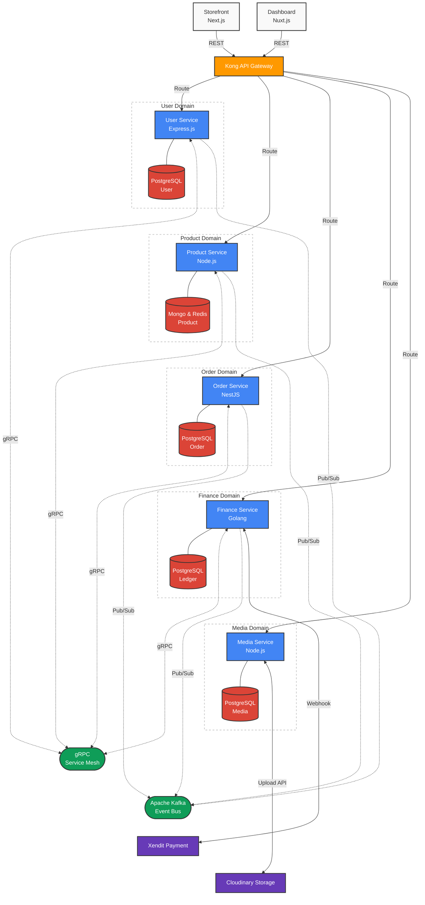

## Overview

**Live System Showcase And More Documentation:** [https://g-nexa-project-showcase.vercel.app/](https://g-nexa-project-showcase.vercel.app/)

**GitHub Repository (Copy URL):**

```text
https://github.com/muhammadwildanskyyy/G-NEXA.git
```

Designing systems that can scale infinitely while remaining maintainable is the ultimate challenge in backend engineering. **G-NEXA** is my solution to this challenge—a comprehensive, polyglot microservices ecosystem encompassing five specialized core domains: `Users`, `Product`, `Order`, `Finance`, and `Media`.

Instead of relying on a monolithic structure, G-NEXA empowers each service to operate independently, written in the language best suited for its workload—ranging from compiled **Go** for high-throughput computations to **NestJS** and **Express.js** for rapid API domain logic. The entire infrastructure is orchestratable locally with a single `Taskfile` command via Docker containers.

## High-Level Topology & Flow

To ensure precise operational isolation, each layer's responsibilities are divided strictly across the Gateway, Compute nodes, and Backbones framework:



## Default Service Architecture & Features

- **Polyglot Ecosystem**: A diverse stack architecture where services are natively implemented in Go, NestJS, and Express.js based on domain-specific requirements, demonstrating deep proficiency across multiple modern backend ecosystems.
- **gRPC Inter-Service Communication**: Migrated exhaustive HTTP/REST server-to-server calls to highly optimized **gRPC protocols**. This guarantees sub-millisecond, type-safe data serialization between crucial modules like _Order_ and _Finance_, drastically reducing cross-service payload overhead.
- **Event-Driven Architecture via Apache Kafka**: Implemented a robust asynchronous pub/sub messaging backbone utilizing **Apache Kafka** to decouple high-load cross-domain mutations. Instead of risking cascading failures during a multi-service operations (like checkout), services emit real-time events, significantly increasing the system's fault tolerance during traffic spikes.
- **Centralized Kong API Gateway**: Utilized **Kong** to manage internal and external routing prefixes safely, creating a unified entry point, masking microservice endpoints, and standardizing load balancing and rate limiting.
- **Global Redis Caching Layer**: Engineered an aggressive caching layer utilizing **Redis** with strategic 5-minute TTL configurations logic. Implemented directly in Go drivers, NestJS CacheModules, and Express `ioredis`, allowing read-heavy endpoints (like Product catalogs and User profiles) to offload immense database strain.
- **Hybrid Database Strategy**: Merged **PostgreSQL** relational integrity (for transactional states like Finance and Orders) with **MongoDB** flexibility, tailoring read-write paradigms explicitly for each microservice.

## The Engineering Challenge

The most complex hurdle during the development of G-NEXA was **service synchronization and payload performance**. Initially, services communicated via standard RESTful HTTP APIs. As the system grew, serialization overhead and network latency compounded into notable bottlenecks during synchronous chained requests (e.g., placing an `Order` which inherently triggers `Payment/Finance`, which alters `Product` inventory).

To mitigate this, I spearheaded a complete migration to **gRPC**. Generating strict Protobuf definitions ensured that our Go and Node-based environments passed binary-encoded data effortlessly, erasing the heavy JSON parsing loops.

Additionally, maintaining state consistency across isolated **Microservices** (Database-per-Service) introduced complex transaction boundaries. By designing a distributed invalidation caching strategy through Redis, the application began capturing incoming writes and invalidating stale catalog reads instantly. For complex distributed transactions, I introduced an **Event-Driven Strategy** via Kafka implementing Saga patterns and idempotency keys to ensure that failed inter-domain events could safely retry without duplicating records. ## Technical Deep Dive: Concurrent Service Orchestration

A critical challenge in microservices is orchestrating multiple communication protocols (HTTP, gRPC, and Kafka) within a single process without blocking. Below is a snippet of the **Finance Service** bootstrap logic, demonstrating how I manage concurrent listeners and graceful shutdowns in Go.

```go
// G-NEXA Finance Service: main.go snippet
func main() {
    ctx, cancel := context.WithCancel(context.Background())
    defer cancel()

    // 1. Initialize Resources
    db := resources.InitDB(cfg)
    redis := resources.InitRedis(cfg)

    // 2. Orchestrate Kafka Consumers (Async Backbone)
    consumer := kafka.NewConsumer(cfg.Kafka.Broker, cfg.Kafka.UserTopic)
    go func() {
        consumer.Start(ctx, func(c context.Context, msg []byte) error {
            return kafka.HandlerConsumer(c, msg, walletUseCase)
        })
    }()

    // 3. Start HTTP API Gateway (REST)
    router := gin.New()
    routes.SetupRoutes(router, walletHandler, paymentHandler)
    go func() {
        if err := router.Run(":" + cfg.App.Port); err != nil {
            logger.Error(ctx, "Failed to start Gin server", err)
        }
    }()

    // 4. Start gRPC Service Mesh (RPC)
    grpcServer := grpc.NewServer()
    financePb.RegisterFinanceServiceServer(grpcServer, financeGrpcHandler)
    go func() {
        if err := grpcServer.Serve(lis); err != nil {
            logger.Error(ctx, "Failed to start gRPC server", err)
        }
    }()

    // 5. Graceful Shutdown
    quit := make(chan os.Signal, 1)
    signal.Notify(quit, syscall.SIGINT, syscall.SIGTERM)
    <-quit

    grpcServer.GracefulStop()
    consumer.Close()
}
```

### Why this matters

By utilizing Go's **goroutines** for each transport layer (HTTP, gRPC, and Kafka), the service achieves true non-blocking orchestration. The **graceful shutdown** sequence ensures that in-flight Kafka messages are processed and gRPC connections are drained before the process exits, preventing data loss in transactional ledger operations.
